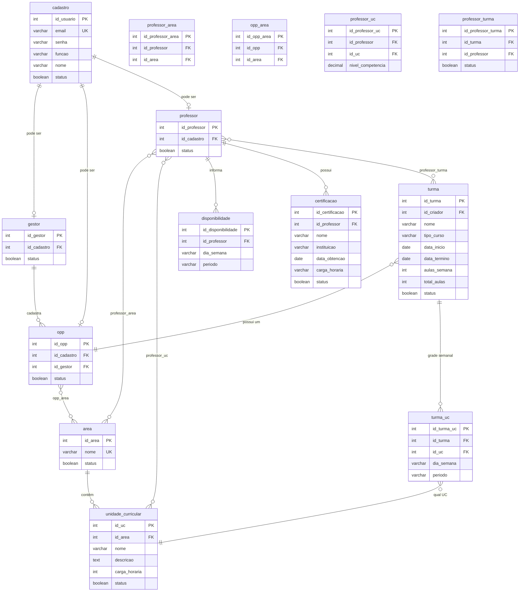
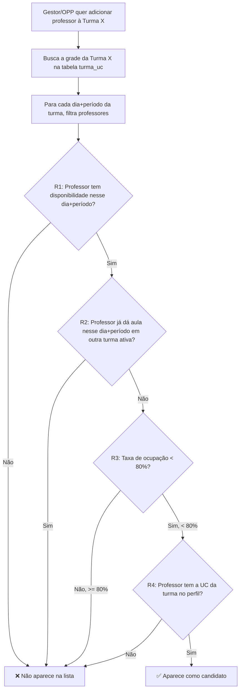
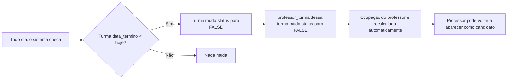

# 🗄️ Proposta do Banco de Dados — Sistema de Gestão Escolar (v2)

> Versão atualizada com as respostas do Cauê e regras de negócio de designação de professores.

---

## 1. Regras de Negócio Confirmadas

### 👤 Professor
- **NÃO é fixo de um OPP** — ele seleciona suas próprias áreas de atuação
- **Pode atuar em várias áreas** (relação N:N professor ↔ area)
- OPP só enxerga professores **das suas áreas**
- Gestor enxerga **todos** os professores

### 📋 Turma
- Pode ser criada por um **Gestor** ou por um **OPP**
- Se o Gestor cria, ele pode colocar a si mesmo (como gestor responsável) ou designar OPP(s)
- Uma turma pode ter **apenas um OPP** responsável
- Uma turma tem **múltiplas UCs** distribuídas em dias/períodos

### ⚙️ Regras de Designação de Professor (o "motor inteligente" do sistema)

Essas regras são checadas **antes** de permitir que um gestor/OPP adicione um professor a uma turma:

| # | Regra | O que verifica | Quando bloqueia |
|---|-------|---------------|-----------------|
| R1 | **Disponibilidade** | O professor informou que está disponível naquele dia da semana E naquele período? | Se o professor não marcou disponibilidade para segunda/manhã, ele não aparece para turmas de segunda/manhã |
| R2 | **Conflito de Horário** | O professor já está em outra turma ativa no mesmo dia + período? | Se já dá aula segunda/M01 na turma X, não pode ser colocado em outra turma segunda/M01 |
| R3 | **Taxa de Ocupação** | O professor tem ocupação < 80%? | Se está com 80% ou mais dos seus horários disponíveis já preenchidos, **não aparece** na lista de candidatos |
| R4 | **Competência na UC** | O professor tem aquela Unidade Curricular no perfil dele? | Se a turma precisa de "Power BI" e o professor não tem essa UC, não aparece |
| R5 | **Liberação Automática** | Quando `data_termino` de uma turma passa, a ocupação é recalculada | Professor volta a ficar disponível automaticamente |

> [!TIP]
> **Essas 5 regras são o grande diferencial do seu TCC!** Na apresentação, você pode mostrar: "O sistema não deixa designar um professor sobrecarregado ou indisponível — ele calcula tudo automaticamente." Isso impressiona a banca.

---

## 2. Como Calcular a Taxa de Ocupação

Essa é uma das partes mais legais do sistema. Vou explicar passo a passo:

### Fórmula

```
Taxa de Ocupação = (Períodos Ocupados / Períodos Disponíveis) × 100
```

### Exemplo prático

Imagine o **Professor João**:

**Passo 1 — Disponibilidade dele** (tabela `disponibilidade`):
| Dia | Período |
|-----|---------|
| Segunda | Manhã |
| Segunda | Tarde |
| Terça | Manhã |
| Quarta | Manhã |
| Quinta | Manhã |

→ **5 períodos disponíveis**

**Passo 2 — Turmas ativas dele** (tabelas `professor_turma` + `turma_uc`, onde `turma.data_termino >= hoje`):
| Turma | Dia | Período |
|-------|-----|---------|
| CPTMTDS04 | Segunda | Manhã |
| CPTMTDS03 | Terça | Manhã |
| CPTMTDS03 | Quarta | Manhã |
| CPTMTDS01 | Quinta | Manhã |

→ **4 períodos ocupados**

**Passo 3 — Cálculo**:
```
Ocupação = (4 / 5) × 100 = 80%  →  ❌ BLOQUEADO (>= 80%)
```

João não aparece mais como candidato para nenhuma turma até que uma das suas turmas termine ou ele adicione mais disponibilidade.

> [!NOTE]
> **Por que 80% e não 100%?** Porque se o professor ficasse 100% ocupado, não teria margem para imprevistos (reuniões, substituições, etc.). O limite de 80% é uma boa prática de gestão. Você pode justificar isso na apresentação!

---

## 3. Diagrama de Relacionamentos (Atualizado)



---

## 4. Tabelas Detalhadas — Campo a Campo

### 4.1 `cadastro` ✅ Manter como está

> **Propósito:** Dados de login comuns a todos os perfis.

| Campo | Tipo | Regras | Explicação |
|-------|------|--------|------------|
| `id_usuario` | INT, PK, AUTO_INCREMENT | obrigatório | Identificador único |
| `email` | VARCHAR(255), UNIQUE | obrigatório | Login do usuário |
| `senha` | VARCHAR(255) | obrigatório | Hash da senha (bcrypt) |
| `funcao` | VARCHAR(50) | obrigatório | `'gestor'`, `'opp'` ou `'professor'` |
| `nome` | VARCHAR(100) | obrigatório | Nome completo |
| `status` | BOOLEAN, default TRUE | obrigatório | Soft delete |

### 4.2 `gestor` ⚠️ Remover campo `setor`

> **Propósito:** O gestor vê tudo — não precisa de filtro por setor/área.

| Campo | Tipo | Regras |
|-------|------|--------|
| `id_gestor` | INT, PK, AUTO_INCREMENT | — |
| `id_cadastro` | INT, FK → cadastro, UNIQUE | 1 cadastro = no máximo 1 gestor |
| `status` | BOOLEAN, default TRUE | — |

### 4.3 `opp` ⚠️ Remover campo `setor`

> **Propósito:** O OPP agora se liga a áreas pela tabela `opp_area` (N:N), em vez de um campo texto.

| Campo | Tipo | Regras |
|-------|------|--------|
| `id_opp` | INT, PK, AUTO_INCREMENT | — |
| `id_cadastro` | INT, FK → cadastro, UNIQUE | — |
| `id_gestor` | INT, FK → gestor | Qual gestor cadastrou esse OPP |
| `status` | BOOLEAN, default TRUE | — |

### 4.4 `professor` ⚠️ Remover campo `id_opp`

> **Mudança importante:** O professor não é mais "fixo" de um OPP. Ele escolhe suas áreas, e os OPPs das mesmas áreas o visualizam automaticamente.

| Campo | Tipo | Regras |
|-------|------|--------|
| `id_professor` | INT, PK, AUTO_INCREMENT | — |
| `id_cadastro` | INT, FK → cadastro, UNIQUE | — |
| `status` | BOOLEAN, default TRUE | — |

### 4.5 `area` 🆕 NOVA

> **Propósito:** Centraliza as áreas (Tecnologia, Manutenção, etc.) que conectam UCs, OPPs e professores.

| Campo | Tipo | Regras |
|-------|------|--------|
| `id_area` | INT, PK, AUTO_INCREMENT | — |
| `nome` | VARCHAR(100), UNIQUE | "Tecnologia", "Manutenção", etc. |
| `status` | BOOLEAN, default TRUE | — |

### 4.6 `professor_area` 🆕 NOVA (N:N)

> **Propósito:** Professor escolhe suas áreas de atuação (pode ter várias). É o que aparece na aba "Área de Atuação" do `PerfilProfessor.vue`.

| Campo | Tipo | Regras |
|-------|------|--------|
| `id_professor_area` | INT, PK, AUTO_INCREMENT | — |
| `id_professor` | INT, FK → professor | — |
| `id_area` | INT, FK → area | — |
| | | UNIQUE(id_professor, id_area) |

> [!NOTE]
> **Como o OPP "enxerga" os professores?** Consulta: *"me dê todos os professores que têm pelo menos 1 área em comum com as áreas do OPP logado"*. Isso é um JOIN entre `professor_area` e `opp_area` pela `id_area`.

### 4.7 `opp_area` 🆕 NOVA (N:N)

> **Propósito:** Define quais áreas cada OPP gerencia. Atribuído pelo gestor.

| Campo | Tipo | Regras |
|-------|------|--------|
| `id_opp_area` | INT, PK, AUTO_INCREMENT | — |
| `id_opp` | INT, FK → opp | — |
| `id_area` | INT, FK → area | — |
| | | UNIQUE(id_opp, id_area) |

### 4.8 `unidade_curricular` 🔄 Renomear de `disciplina`

> **Propósito:** As UCs são as "matérias" (Power BI, Front-End, etc.). Cada uma pertence a uma área.

| Campo | Tipo | Regras |
|-------|------|--------|
| `id_uc` | INT, PK, AUTO_INCREMENT | — |
| `id_area` | INT, FK → area | A qual área pertence |
| `nome` | VARCHAR(150) | "Programação Web", etc. |
| `descricao` | TEXT, nullable | Descrição da competência |
| `carga_horaria` | INT, nullable | Em horas (ex: 80) |
| `status` | BOOLEAN, default TRUE | — |

### 4.9 `professor_uc` 🔄 Renomear de `professor_disciplina`

> **Propósito:** Qual professor domina qual UC e com qual nível. É a barrinha de progresso do perfil. **Também é usada na Regra R4** (só pode ser designado se tiver a UC).

| Campo | Tipo | Regras |
|-------|------|--------|
| `id_professor_uc` | INT, PK, AUTO_INCREMENT | — |
| `id_professor` | INT, FK → professor | — |
| `id_uc` | INT, FK → unidade_curricular | — |
| `nivel_competencia` | DECIMAL(5,2) | 0.00 a 100.00 |
| | | UNIQUE(id_professor, id_uc) |

### 4.10 `turma` ⚠️ Ajustada

> **Mudanças:** 
> - `id_uc` removido (agora é N:N via `turma_uc`)
> - `id_opp` adicionado (relação 1:N — uma turma tem um OPP)
> - `id_gestor` virou `id_criador` → aponta para `cadastro` (pode ser gestor OU opp)
> - Campos novos: `tipo_curso`, `aulas_semana`, `total_aulas`

| Campo | Tipo | Regras | Explicação |
|-------|------|--------|------------|
| `id_turma` | INT, PK, AUTO_INCREMENT | — | — |
| `id_criador` | INT, FK → cadastro | obrigatório | Quem criou (pode ser gestor ou OPP) |
| `id_opp` | INT, FK → opp | obrigatório | OPP responsável pela turma |
| `nome` | VARCHAR(100) | obrigatório | "CPTMTDS04" |
| `tipo_curso` | VARCHAR(10) | obrigatório | `'TEC'`, `'CAI'` ou `'FIC'` |
| `data_inicio` | DATE | obrigatório | — |
| `data_termino` | DATE | obrigatório | — |
| `aulas_semana` | INT, nullable | opcional | Aulas por semana |
| `total_aulas` | INT, nullable | opcional | Total de aulas do curso |
| `status` | BOOLEAN, default TRUE | — | — |

> [!IMPORTANT]
> **Por que `id_criador` aponta para `cadastro` e não para `gestor`?** Porque tanto gestores quanto OPPs podem criar turmas. Como ambos têm um registro em `cadastro`, apontar pra lá resolve sem complicar.

### 4.11 `turma_opp` 🗑️ REMOVIDA


### 4.12 `turma_uc` 🆕 NOVA (grade semanal)

> **Propósito:** A "grade de horários" da turma — qual UC acontece em qual dia e período. É o que o `addTurmas.vue` monta com os cards de dias da semana.

| Campo | Tipo | Regras | Explicação |
|-------|------|--------|------------|
| `id_turma_uc` | INT, PK, AUTO_INCREMENT | — | — |
| `id_turma` | INT, FK → turma | obrigatório | — |
| `id_uc` | INT, FK → unidade_curricular | obrigatório | — |
| `dia_semana` | VARCHAR(20) | obrigatório | `'segunda'`, `'terca'`, `'quarta'`, `'quinta'`, `'sexta'`, `'sabado'` |
| `periodo` | VARCHAR(10) | obrigatório | `'M01'`, `'M02'`, `'T01'`, `'T02'`, `'N01'`, `'N02'`, `'INT'` |
| | | UNIQUE(id_turma, dia_semana, periodo) | Não pode ter 2 UCs no mesmo horário da mesma turma |

> [!NOTE]
> **Essa tabela é chave para a Regra R2 (conflito de horário).** Quando for designar um professor, o sistema cruza os `dia_semana + periodo` dessa turma com os de todas as outras turmas ativas do professor.

### 4.13 `professor_turma` ⚠️ Corrigir constraints

> **O que mudou:** Agora é N:N de verdade — 1 professor em várias turmas E 1 turma com vários professores.

| Campo | Tipo | Regras |
|-------|------|--------|
| `id_professor_turma` | INT, PK, AUTO_INCREMENT | — |
| `id_turma` | INT, FK → turma | — |
| `id_professor` | INT, FK → professor | — |
| `status` | BOOLEAN, default TRUE | — |
| | | UNIQUE(id_turma, id_professor) | Par único |

### 4.14 `disponibilidade` ⚠️ Ajustada

> **Mudança:** `dia` (DATE) virou `dia_semana` (VARCHAR). Porque no frontend o professor marca "segunda", "terça", não uma data específica.

| Campo | Tipo | Regras | Explicação |
|-------|------|--------|------------|
| `id_disponibilidade` | INT, PK, AUTO_INCREMENT | — | — |
| `id_professor` | INT, FK → professor | obrigatório | — |
| `dia_semana` | VARCHAR(20) | obrigatório | `'segunda'`, `'terca'`, etc. |
| `periodo` | VARCHAR(20) | obrigatório | `'manha'`, `'tarde'`, `'noite'`, `'integral'` |
| | | UNIQUE(id_professor, dia_semana) | 1 período por dia |

> [!TIP]
> **Essa tabela é a base da Regra R1 e do cálculo de ocupação.** O total de registros aqui = "períodos disponíveis" do professor.

### 4.15 `certificacao` 🆕 NOVA

| Campo | Tipo | Regras |
|-------|------|--------|
| `id_certificacao` | INT, PK, AUTO_INCREMENT | — |
| `id_professor` | INT, FK → professor | — |
| `nome` | VARCHAR(200) | "AWS Cloud Practitioner" |
| `instituicao` | VARCHAR(200), nullable | "Amazon", "Google" |
| `data_obtencao` | DATE, nullable | — |
| `carga_horaria` | VARCHAR(20), nullable | "40h", "120h" |
| `status` | BOOLEAN, default TRUE | — |

---

## 5. Fluxo de Designação de Professor (as 5 Regras em ação)

Quando o gestor/OPP clica em "Designar Professor" para uma turma, o sistema executa:



### R5: Liberação Automática



> [!NOTE]
> **A R5 pode ser implementada de duas formas:**
> 1. **Cron job** — um script que roda todo dia à meia-noite e verifica turmas vencidas
> 2. **Cálculo em tempo real** — toda vez que alguém consulta a ocupação, o sistema filtra apenas turmas com `data_termino >= hoje`
> 
> **Recomendo a opção 2** para um TCC — é mais simples, não precisa configurar cron, e o resultado é o mesmo. A query simplesmente ignora turmas vencidas.

---

## 6. Resumo Final das Tabelas

| # | Tabela | Tipo | Mudança |
|---|--------|------|---------|
| 1 | `cadastro` | Principal | ✅ Manter |
| 2 | `gestor` | Principal | ⚠️ Remover `setor` |
| 3 | `opp` | Principal | ⚠️ Remover `setor` |
| 4 | `professor` | Principal | ⚠️ Remover `id_opp` |
| 5 | `area` | Principal | 🆕 Criar |
| 6 | `unidade_curricular` | Principal | 🔄 Renomear de `disciplina` |
| 7 | `professor_area` | Ligação N:N | 🆕 Criar |
| 8 | `opp_area` | Ligação N:N | 🆕 Criar |
| 9 | `professor_uc` | Ligação N:N | 🔄 Renomear de `professor_disciplina` |
| 10 | `turma` | Principal | ⚠️ Ajustar campos |
| 11 | `turma_opp` | Ligação N:N | 🗑️ Remover (id_opp agora está em turma) |
| 12 | `turma_uc` | Grade semanal | 🆕 Criar |
| 13 | `professor_turma` | Ligação N:N | ⚠️ Corrigir constraints |
| 14 | `disponibilidade` | Dados | ⚠️ Trocar `dia` → `dia_semana` |
| 15 | `certificacao` | Dados | 🆕 Criar |

**Total: 15 tabelas** (6 principais + 5 de ligação N:N + 4 de dados)

---

## 7. Plano de Implementação — Etapas

> ✅ **Aprovado:** 15 tabelas + 5 regras de designação + R5 em tempo real

### Fase 1 — Banco de Dados
| # | Tarefa | Descrição |
|---|--------|-----------|
| 1.1 | Gerar SQL `CREATE TABLE` | Script completo com todas as FK e UNIQUE |
| 1.2 | Criar nova migration TypeORM | Substituir a migration atual |
| 1.3 | Atualizar todas as entities | Refletir o novo modelo (15 entities) |
| 1.4 | Criar seed de dados | Dados de exemplo para testar |

### Fase 2 — CRUD Básico (rotas + controllers)
| # | Tarefa | Descrição |
|---|--------|-----------|
| 2.1 | CRUD de Áreas | Gestor cria/edita/lista/exclui áreas |
| 2.2 | CRUD de Unidades Curriculares | Vinculadas a uma área |
| 2.3 | CRUD de Turmas | Com grade semanal (turma_uc) e OPPs |
| 2.4 | Perfil do Professor | Áreas, UCs, certificações, disponibilidade |

### Fase 3 — Motor de Designação (o diferencial)
| # | Tarefa | Descrição |
|---|--------|-----------|
| 3.1 | Serviço de cálculo de ocupação | Query em tempo real (ignora turmas vencidas) |
| 3.2 | Filtro de candidatos (R1-R4) | Disponibilidade + conflito + ocupação + UC |
| 3.3 | Endpoint "listar professores disponíveis" | Recebe id_turma, retorna candidatos válidos |
| 3.4 | Endpoint "designar professor" | Valida regras e cria professor_turma |

### Fase 4 — Permissões por Perfil
| # | Tarefa | Descrição |
|---|--------|-----------|
| 4.1 | Middleware de permissão | Gestor vê tudo, OPP vê só suas áreas |
| 4.2 | Filtro de professores por área | OPP só vê professores das suas áreas |
| 4.3 | Filtro de turmas por OPP | OPP só vê turmas onde foi adicionado |

**Vamos começar pela Fase 1.1 — gerar o SQL `CREATE TABLE`?**
